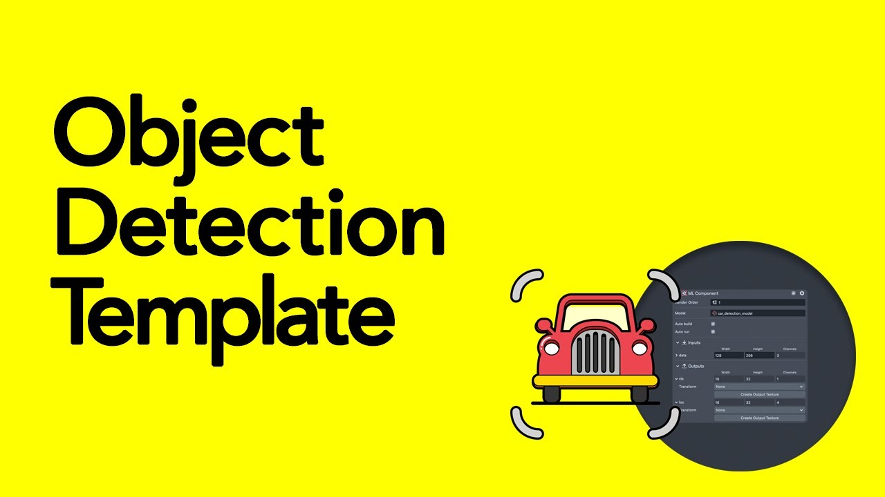
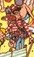
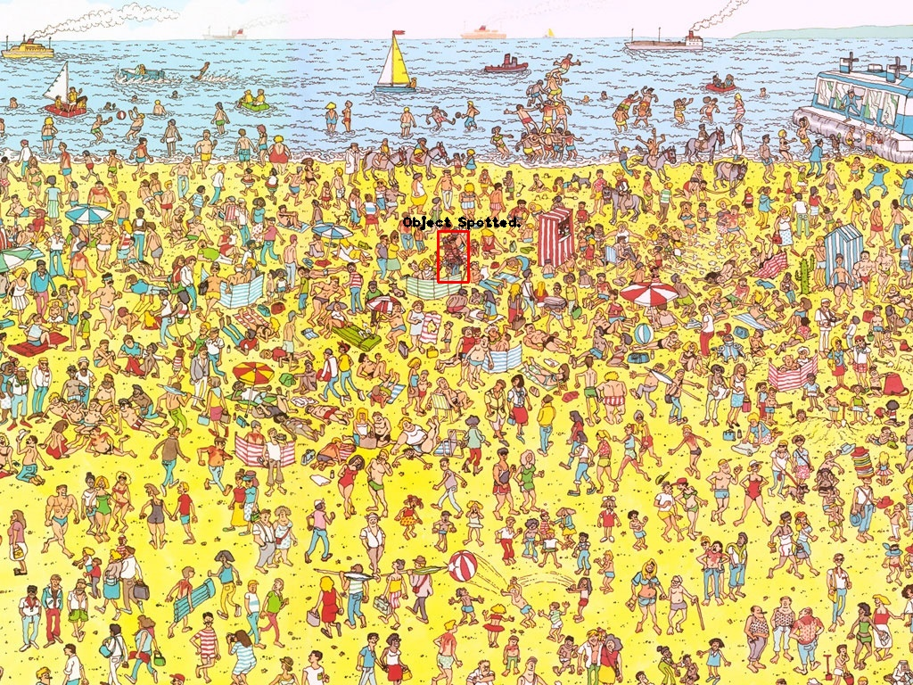
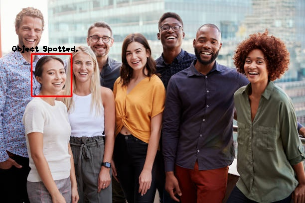
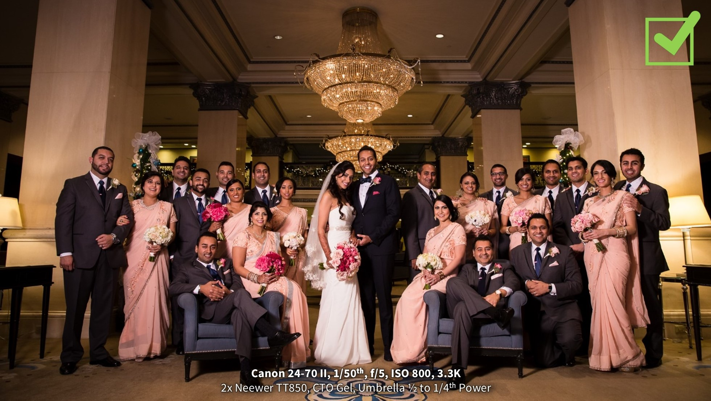
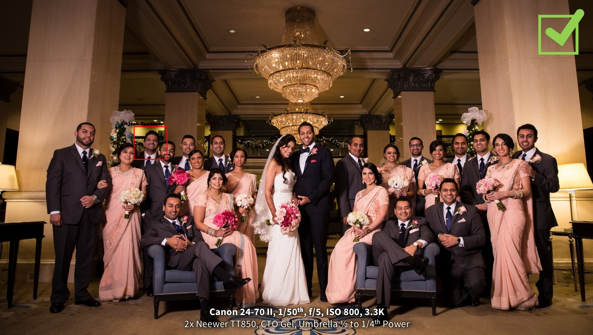
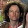
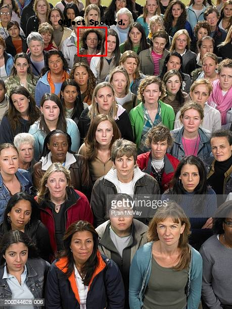

<div align="center">
   <h1> Object Detection Project Using OpenCV </h1> 
  
</div>


> This project uses Template Matching technique for object detecting by detection the template image over base image.

## REQUIREMENTS
 + Python <a href="https://www.python.org" target="_blank">
</img></a>&nbsp;&nbsp;

+ OpenCV  <a href="https://opencv.org/"></img></a>&nbsp;&nbsp;


```
pip install opencv-python
pip install Tkinter
```

<h2> 📝 CODE EXPLANATION </h2>
<samp><b>Importing Differnt Libraries</b></samp>

```python
import cv2
import tkinter as tk 
from tkinter import filedialog 
import os
```
***
## Taking Uer Input using TKinter
```py
root = tk.Tk() 
root.withdraw() 
file_path_base = filedialog.askopenfilename(initialdir= os.getcwd(),title="Select Base Image: ")
file_path_temp= filedialog.askopenfilename(initialdir= os.getcwd(),title="Select Template Image: ")
```
***

<samp>Loading base image and template image using `cv2.imread()`</samp>
<table>
<tr>
    <td>
        <b>Input Image</b>
    </td>
    <td>
        <b>Template Image</b>
    </td>
    <td>
        <b>Result Image</b>
    </td>
</tr>
<tr>
    <td>
    
    </td>
    <td>
    <div align="center">
    
     </div>
    </td>
    <td>
    
   </td>
</tr>
<tr>
<td>
    
    </td>
    <td>
    <div align="center">
    
     </div>
    </td>
    <td>
    
   </td>
</tr>
<tr>
<td>
    
    </td>
    <td>
    <div align="center">
    
     </div>
    </td>
    <td>
    
   </td>
</tr>
<tr>
<td>
    
    </td>
    <td>
    <div align="center">
    
     </div>
    </td>
    <td>
    
   </td>
</tr>
</table>

```python
img = cv2.imread(file_path_base)
```
***
`cv2.cvtColor()`method is used to convert an image from one color space to another. There are more than 150 color-space conversion methods available in OpenCV.
> Syntax: cv2.cvtColor(image, code, dst, dstCn)

```python

img_gray = cv2.cvtColor(img, cv2.COLOR_BGR2GRAY)

template = cv2.imread(file_path_temp,0)
```
***
Getting the height and width of the template image using `.shape` method.
```python
h ,w = template.shape
```
***
`cv2.matchTemplate` is used to comapare images. It gives a 2D-array as output. 
```python
match = cv2.matchTemplate(img_gray,template,cv2.TM_CCOEFF_NORMED)
threshold = 0.99
```
***
`cv2.minMaxLoc` returns the top-left corner of the template position for the best match. 
```py
min_val, max_val, min_location, max_location = cv2.minMaxLoc(match)
location = max_location
font = cv2.FONT_HERSHEY_PLAIN
```
***
`cv2.rectangle()` method is used to draw a rectangle on any image.
> Syntax: cv2.rectangle(image, start_point, end_point, color, thickness)
```py
cv2.rectangle(img, location, (location[0] + w, location[1] + h), (0,0,255), 2)
```
***
`cv2.putText()` method is used to draw a text string on any image.
> Syntax: cv2.putText(image, text, start_point, font, fontScale, color, thickness, lineType, bottomLeftOrigin)
```py 
cv2.putText(img,"Waldo Spotted.", (location[0]-40,location[1]-5),font , 1, (0,0,0),2)
```
***
+ `cv2.imwrite()` method is used to save an image to any storage device. This will save the image according to the specified format in current working directory.
+ `cv2.imshow` method is used to display an image in a window. The window automatically fits to the image size.
> Syntax: cv2.imwrite(filename, image)

> Syntax: cv2.imshow(window_name, image)
```py
cv2.imwrite('AI-ML-MINI-PROJECT-2\Pratham\grayscale.jpg',img_gray)
cv2.imshow('grayscale.jpg',img_gray)
cv2.imwrite('AI-ML-MINI-PROJECT-2\Pratham\Results.jpg',img)
cv2.imshow('Results.jpg',img)
```
***
`cv2.waitkey()` allows you to wait for a specific time in milliseconds until you press any button on the keyword.
```py
cv2.waitKey(0)
```
***
`cv2.destroyAllWindows()` method destroys all windows whenever any key is pressed.
```py
cv2.destroyAllWindows()

```

<h2>📬 Contact</h2>

If you want to contact me, you can reach me through below handles.

<a href="https://twitter.com/prrthamm"></img></a>&nbsp;&nbsp; <a href="https://www.linkedin.com/in/pratham-bhatnagar/"></img></a>


